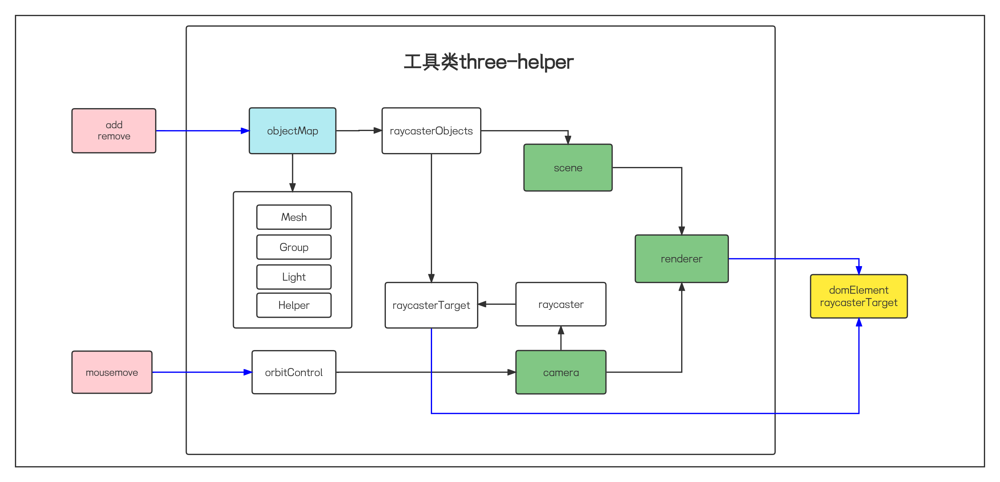

# three-helper

## description

three-helper to use three easier

## architecture



## how to use

### 1. Install it from npm

```bash
npm i three-helper
```

### 2. Import and use it

```js
// import it
import { ThreeHelper } from 'three-helper'

// new instance
const helper = new ThreeHelper()

// init it with width and height
const domElement = helper.init(width,height)

// get parent node and append to it
const parent = document.getElementById('parent')
parent.appendChild(domElement)
```
